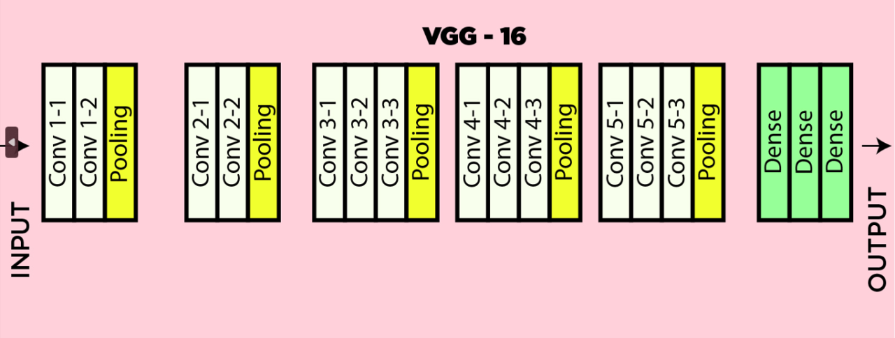

# Real-Time Naruto Hand Sign Classification with ML

## Overview

This project utilizes ML to recognize the 12 hand signs from [Naruto](https://naruto.fandom.com/wiki/Narutopedia)

[Check out the demo here!](https://huggingface.co/spaces/tyhu02/naruto-hand-seals)

**Key Features:**
- includes data collection script using OpenCV
- transfer learning with VGG16 (pre-trained on ImageNet)
- real-time inference via webcam
- deployed on Hugging Face Spaces with Gradio

## Achitecture

**Transfer Learning Strategy:**
  - Layers 1-14: Frozen (preserve general visual features)
  - Layers 15-16: Fine-tuned for hand seal-specific features

## Dataset

- **Total Images:** ~7,200, 6,000 training / 1,200 testing
- **Classes:** 12 (Bird, Boar, Dog, Dragon, Hare, Horse, Monkey, Ox, Ram, Rat, Serpent, Tiger)
- **Collection Method:** script using OpenCV + manual pictures from myself and family members
- **Preprocessing:** Resized to 224×224, normalized (rescale 1/255)

**Data Augmentation:**
- rotation (±25°) 
- width/height shifts (30%)
- shear (50%), zoom (30%) 
- horizontal flip
- brightness adjustments (80-110%)

## Results
- **Validation Accuracy:** ~93.8%
- **Training Time:** ~1 hour (14 epochs on Google Colab)
- **Optimization:** Adam optimizer (lr=0.0001) with early stopping

## Technologies
- **Deep Learning:** TensorFlow/Keras, VGG16
- **Computer Vision:** OpenCV
- **Deployment:** Gradio, Hugging Face Spaces
- **Training:** Google Colab
